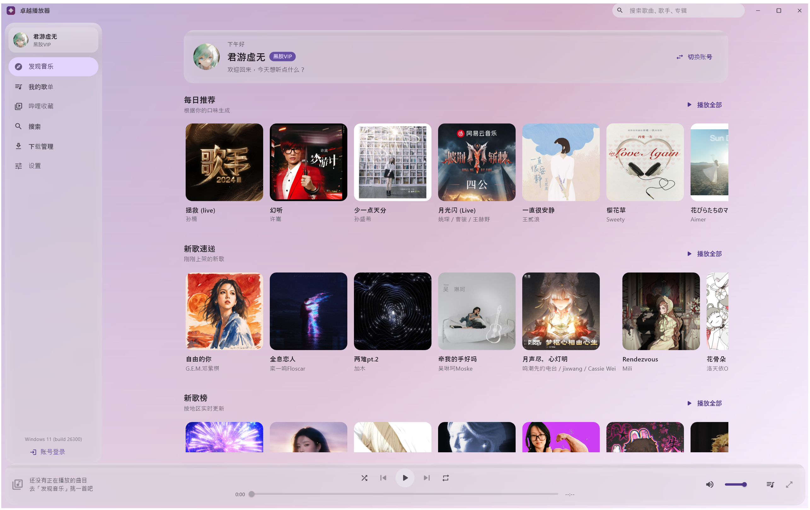
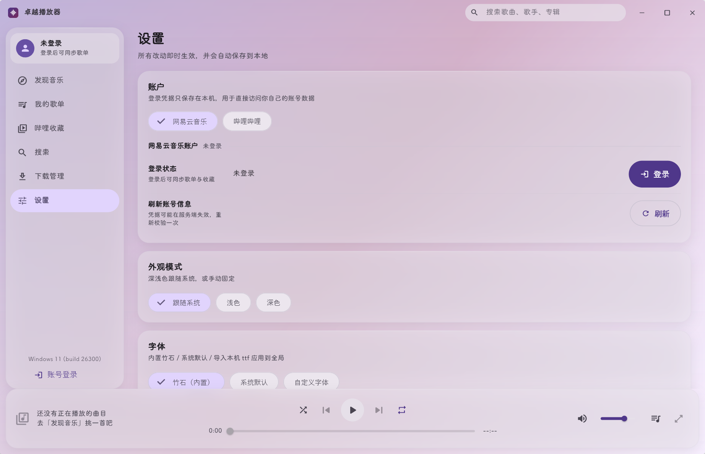

# 卓越播放器 / ZhuoYue Player

**一个 Windows 桌面上的第三方网易云音乐客户端，同时能把你在哔哩哔哩收藏的音乐放进同一个播放队列。**

它面向的是这样一类人：已经在用网易云和哔哩哔哩听歌，但不想为了"把两边收藏的歌连着放"而在两个客户端之间来回切；也不想要官方客户端里那一整套社交、直播、短视频入口，只想要一个干净的、能好好放歌的桌面窗口。

> Dart 包名 `zhuoyue_player`，组织 `com.zhuoyue`，当前版本 `0.1.0+1`（见 `pubspec.yaml`）。

## 它有什么不同

1. **不依赖任何官方客户端**：网易云走内嵌的 Node + `NeteaseCloudMusicApi`（非官方接口封装），哔哩哔哩由 Dart 直连接口；两者共用一个 `MusicRepository` 抽象与 `Song` 模型，**播放器完全不感知音源差异** —— 所以在同一个队列里顺序播放两家的歌是结构性支持的，不是打了补丁。
2. **Material You 取色 + 亚克力材质**：主色由当前封面用与 Android 12 `DynamicColors` 同源的算法（Celebi 量化 + Score 打分）实时推导，9 种配色变体、4 档对比度；窗口有 6 种材质（亚克力 / Mica / Mica Alt / 高斯模糊 / 模拟磨砂 / 实色），自研 `dart:ffi` 直接调 Win32，不用已停更的 `flutter_acrylic`。
3. **内置竹石字体**（`assets/fonts/zhuzi.ttf`，17 MB）：中文小字的观感是刻意调过的 —— 该字体只有 w400 一个字面，全应用**不请求 w600/w700**（否则 Flutter 会描边合成粗体，中文小字发虚），层次由字号与颜色承担，并有测试钉住这条不变量。它**随源码仓库分发**（因为体积大、且是作者自用字体），但**不进安装包** —— 字体缺失时代码回退到系统字体，不会崩。详见附录「字体说明」。
4. **对做不到的事情直说**：均衡器做了界面但后端不生效，就在面板上挂「当前后端不生效」徽标；无缝衔接只能做到预解析下一首，设置里那段副标题就写明"采样级无缝需要播放后端支持"；音质「自动」的自我校正只会单向收紧、降级后不会自己恢复，也直接写出来。
5. **离线可用**：拉取过的歌单 / 收藏夹缓存在本地，打开即秒开、断网可看；同步是差量拉取（当天新增 2 首的歌单只发 1 次请求），同步失败不清空已展示的内容。



上图为实际运行的 Debug 构建、已登录状态：账号卡片、每日推荐、新歌速递、新歌榜的封面与歌名都来自内嵌服务对网易云接口的真实请求，主题主色则是从这些封面取色推导出来的（所以整屏是随封面变化的淡紫色）。



> 其余视角的截图尚未补齐：深色方案、播放队列 island、播放页歌词。

## 免责声明（请先读这一段）

- 本项目是**个人学习与研究**用途的第三方客户端，与**网易云音乐（网易）**和**哔哩哔哩（Bilibili）没有任何隶属、合作或授权关系**，也不代表它们的立场。
- 项目使用的是**非官方接口**，接口随时可能变更或失效；本项目不保证可用性与稳定性，也不提供任何形式的服务承诺。
- **请勿用于商业用途、批量抓取**，或用于**绕过任何付费与版权限制**。项目不实现也不接受任何破解、去广告、伪造会员权益参数（如伪造 `privilege` / `vipType`）的逻辑。
- 能播放不等于获得内容授权。**请通过官方渠道支持创作者**：在官方客户端开通会员、购买数字专辑。
- 登录凭据只保存在**本机**的应用数据目录（`shared_preferences`），不上传到任何服务器。
- 因使用本项目产生的任何后果由使用者自行承担。

完整的合规说明见 [docs/api-integration.md](docs/api-integration.md) 的「合规说明」。

---

## 安装与首次运行

### 安装包提供什么

安装包（Inno Setup 产出的 `*-setup.exe`）包含：

| 组成 | 说明 |
| --- | --- |
| 应用本体 | `zhuoyue_player.exe` + `flutter_windows.dll` + 四个原生插件 DLL + `data/`（AOT 产物、图标）。约 30.5 MB —— **安装包不含内置字体**（打包时会被摘掉，见附录「字体说明」）。 |
| **不含**内嵌运行时 | `runtime/`（便携版 Node.js + `NeteaseCloudMusicApi`，约 121 MB）**不进安装包**，由应用在**首次启动时联网下载**。这样安装包小得多，代价是首次启动必须联网。 |

> 安装包本身怎么构建、`.iss` 里各页面怎么配的，见 [packaging/README.md](packaging/README.md)（开发者文档）。

### 安装时可以选哪些路径

安装向导里有三个路径，各自影响什么：

| 可选路径 | 影响什么 | 安装向导里的默认值 |
| --- | --- | --- |
| **安装路径** | 应用本体（`zhuoyue_player.exe`、DLL、`data/`）的位置。**运行时不在安装目录**，它落在应用数据目录 | `%LOCALAPPDATA%\Programs\ZhuoYue Player`（**按用户安装，不需要管理员权限**，也不弹 UAC；想装到 `Program Files` 可以自己改路径，那时会要管理员） |
| **缓存路径** | 歌单缓存、封面磁盘缓存、下载任务清单 | `%APPDATA%\ZhuoYue Player\cache` |
| **下载路径** | 下载的音乐文件落盘位置 | `%USERPROFILE%\Documents\ZhuoYue Player\Music`，并按音源分子目录（`网易云音乐\` / `哔哩哔哩\`） |

- 安装器把这三项写进 `%APPDATA%\com.zhuoyue\zhuoyue_player\installer.json`，应用读它并采纳一次；之后你在应用里改过的路径**不会**被安装器的旧值盖回去。
- 没有读到安装器配置时（例如直接从源码运行、或你自己解压一份 Release），缓存与下载目录会回落到应用自己的默认值：缓存 `%APPDATA%\com.zhuoyue\zhuoyue_player\`、下载 `%USERPROFILE%\Music\ZhuoYuePlayer`。
- 下载目录在应用内也能改：「下载管理 → 更改目录」（会持久化）。
- 静默安装（`/SILENT`）时，缓存与下载目录会用默认值 —— 这是 Inno Setup 的固有行为，自定义页面的输入没有命令行参数可以替代。
- 安装向导里还会显示**附加任务：创建桌面快捷方式**（默认勾选）。
- 卸载**不会**删除缓存与下载目录，也不会删除登录凭据 —— 重装后登录态还在。
- **安装路径不要选 OneDrive 同步目录**：缓存与运行时会频繁读写，同步客户端会造成额外占用与偶发文件锁。

**完成页上还有两个勾选框**：「立即运行 卓越播放器」与「开机自启动（写入当前用户的启动项，可随时在应用设置里关掉）」。开机自启动走当前用户的注册表 `Run` 项（`HKCU\...\Run\ZhuoYuePlayer`），因此按用户安装与它天然匹配；**卸载时会把这个启动项删掉**。静默安装会跳过这两个勾选框。

### 首次启动：需要联网准备运行时

因为安装包里没有 121 MB 的运行时，**首次启动必须联网**，步骤是：

1. 应用发现自己没有可用的运行时（运行时要包含 `node/` 与 `netease-api/` 两个目录）；
2. 从 **nodejs.org 官方发布目录**下载对应版本的 Node.js win-x64 压缩包，**用 `SHASUMS256.txt` 校验 SHA-256**（校验不通过会直接放弃安装，不会用一份来路不明的字节把事情"装成功"）；
3. 解压并**原子就位**到应用数据目录（同一个用户装过一次就会跳过，不会重复下载那 121 MB）；
4. 之后正常启动，网易云音源可用。

需要满足的前提：

- **能访问 `nodejs.org`**（下载地址与校验和都来自 `https://nodejs.org/dist/...`）。企业网络 / 代理环境下请确认这个域名可达。
- 缓存路径**可写**。
- 杀毒软件 / 安全软件**不要拦截 `node.exe`**：内嵌服务就是一个 `node.exe` 子进程，被拦下来时表现是"网易云所有页面都转圈"。

> **当前状态（很重要）**：下载 / 校验 / 解压 / 就位这条链路在 `lib/core/runtime/runtime_installer.dart` 里已经落地并有离线测试（`test/runtime_installer_test.dart`），但**应用里的入口界面仍在接入中**。
> 因此**引导页的具体文案、进度显示与按钮名称以应用实际界面为准** —— 本文不描述还没定下来的控件。
> 代码里已经定下来的用户可见文案是两条：找不到时的提示为「请在设置里点「下载运行时」自动获取；也可以手动把 runtime 目录（含 node/ 与 netease-api/）放到程序所在目录」，下载失败时按原因给出可读说明（无法连接下载服务器 / HTTP 状态码 / 下载不完整 / SHA-256 校验失败 / 可取消）。
> 需要留意的是：**只看哔哩哔哩与本地播放的话，不准备运行时也能用**（网易云音源才依赖 Node）。

#### 运行时准备失败怎么办

按从易到难的顺序：

1. **先确认网络**：能打开 `https://nodejs.org/dist/` 就说明基本可达；代理软件请确认走了系统代理而不是仅浏览器代理。
2. **再确认杀软**：把运行时目录与 `node.exe` 加入白名单，然后重试（界面会给出重试 / 取消的出路）。
3. **手动指定运行时目录**：设环境变量 `ZHUOYUE_RUNTIME_DIR` 指向一个已经准备好的 `runtime/` 目录（它是查找时的**第一优先级**）；也可以按提示把这个 `runtime/` 目录直接放到 `zhuoyue_player.exe` 旁边。
4. **自己准备一份运行时**（需要仓库或一台能联网的机器）：执行 `pwsh -File scripts/fetch-runtime.ps1`，把生成的整个 `runtime/` 目录拷到目标位置，再用上面的方法指过去。
5. **仍然不行**：打开应用内的调试日志面板（设置 → 维护 → 打开调试日志）看 `[netease]` 相关行。内嵌服务的退出码含义：`2` 加载 API 失败、`3` 版本不兼容、`4` 启动抛错、`5` 60 秒未就绪、`1` 其他。

---

## 使用说明书

导航按「你会怎么用」组织，从左到右共七个分区：**发现音乐 / 我的歌单 / 哔哩收藏 / 搜索 / 下载管理 / 账户 / 设置**，底部常驻播放条。

### 1. 登录

登录入口有两个：左侧导航的「**账户**」页，以及「设置」最上面的**账户分区**。两处驱动的是同一份状态。

**网易云音乐**

- 支持**二维码登录**与**手机号 + 密码**登录。
- 二维码：打开登录窗口后用网易云 App 扫码，状态会依次变成「等待扫码…」→「已扫码，请在手机上确认」→ 登录成功。二维码过期时可点刷新。
- 拿不到二维码图片时（断网 / 接口异常）会退化成展示一个可在浏览器打开的登录链接。
- 手机号 + **短信验证码**登录：服务层有实现，但**界面上没有入口**，用户侧等于未实现。

**哔哩哔哩**

- 只支持**扫码登录**（客户端自己绘制二维码）。
- 不登录也能浏览**公开**收藏夹；要看自己的收藏夹必须登录。

**登录态**

- 登录后凭据写入本机 `shared_preferences`，**重启应用自动恢复**，不需要重新登录。
- 凭据失效时主界面会弹一条带「**重新登录**」动作的提示；主动退出登录不会误报这条提示。
- 网易云的登录态通常能维持数月；**哔哩的会短得多，掉线只能重新扫码**（原因见「常见问题」）。

### 2. 浏览与播歌单

- **发现音乐**：已登录时显示「每日推荐」「新歌速递」「新歌榜」三个分区，往下还有推荐歌单网格。**未登录**时「每日推荐」给出「登录后根据你的口味生成」的空态，其余分区照常。
- **我的歌单**：「我喜欢的音乐」固定置顶，其余按接口原顺序。未登录时整页给登录引导。
- **哔哩收藏**：左栏是收藏夹列表，右栏是曲目。
- **歌单一次取全**：打开一个歌单或收藏夹就会把**完整曲目表**取回来，所以「播放全部」覆盖整个歌单（不是只播已经滚出来的那几十首）。曲目很多时底部会显示「已经到底了 · 共 N 首」。
- **秒开与离线**：打开过的歌单会先渲染本地缓存（一次本地文件读），再在后台与云端同步。断网时已缓存的歌单**仍可浏览**。
- **同步状态条**：显示「本地缓存 / 已同步 · 相对时间 / 新增 N 首、移除 M 首」之类。右侧的**同步频率**按钮可切换 5 档：仅手动 / 每次启动 / 每小时 / 每 6 小时 / 每天；选「仅手动」时只有点「立即同步」才会联网。
- 同步失败**不会清空**已显示的内容，只提示原因。
- **歌单级「收藏」目前不可用**：点歌单头部的收藏按钮会提示「歌单收藏接口尚未接入…」。曲目级的红心是可用的。
- **歌单的创建 / 编辑 / 删除没有实现**。

### 3. 搜索

- 顶部可切换**搜索音源**（网易云 / 哔哩哔哩），切换后立刻重查。
- 输入时有联想词（约 350ms 防抖，最多 8 条，点击直接搜）。哔哩音源不提供联想词。
- 搜索历史只放在内存里，最多 10 条，重复词提到最前，可手动清空 —— **重启应用后历史为空**。
- 没有结果时会给出可操作文案（提示换关键词，或说明可能是版权 / 会员曲目）。
- 结果行可以直接「下载」或加入队列。

### 4. 播放队列

- 队列与音源无关：网易云与哔哩的歌可以混在一起顺序播放。
- **「播放全部」**替换当前队列并开始播放；**「添加到队列」**（在歌单 / 收藏夹头部）把这批歌**追加到队列末尾**，按 uid 去重，不替换、不跳转，正在播放的那首不受影响；队列原本为空时会顺手起播。
- **队列 island**：点播放条右侧的队列按钮，从右边滑入一块玻璃面板，**左侧的歌单仍然可见可点**（不是模态弹窗）。切换左侧导航分区时它会自动收起。
- 队列行：点一下跳播该曲；鼠标悬停出现移除按钮；当前曲目高亮。打开队列时会聚焦当前曲目。
- 队列可清空（队列为空时清空按钮置灰）。
- 播放模式按钮：**一次点击在四种模式间循环** —— 顺序播放 → 列表循环 → 单曲循环 → 随机播放。
- 「上一首」在已播放超过 3 秒时回到本曲开头；3 秒内按则切上一首。
- 顺序播放走到队列尽头会**停住但保留当前曲目**，按播放键可以从头重听。

### 5. 全屏播放页与歌词

- 从播放条右侧进入全屏播放页：**不透明**的高斯模糊背景 + 主题色染色 + 噪点，后面歌单的文字不会透上来。
- 歌词为逐行高亮、**当前行恒定居中**，越远的行越淡，上下边缘渐隐；点击任意一行可跳到该行时刻。
- **手动往上滚动歌词会暂停自动跟随**，滚回当前行附近会自动恢复跟随并吸附回中间。
- 歌词区会区分三种状态：「纯音乐，请欣赏」/「暂无歌词」/ 正在取歌词（转圈）。
- 右上角有「歌词 / 队列 (N)」两个标签页，队列页也能清空队列。
- 顶部「正在播放」那一行仍然可以拖动整个窗口。
- 进度条可拖动 seek，拖动过程中不会被回拽。

### 6. 音质

- **播放条上的音质胶囊显示的是服务端实际给的那一档**（点开可改）。会员权益不足时服务端会静默降级，胶囊就照实显示实际值，**不会**继续显示你选的那一档。
- 设置 → 播放 → 音质，按音源分别选择：
  - **网易云**：自动 / 超清母带 / 高清臻音 / Hi-Res / 无损 / 极高 / 较高 / 标准。
  - **哔哩哔哩**：自动 / Hi-Res 无损 / 杜比全景声 / 默认。哔哩的杜比与 Hi-Res 不是"请求参数"而是"服务端是否下发"，需要大会员且稿件本身提供对应音轨。
- 「**自动**」的含义是"按账号权益取最高"，所以它写的是**目标**而不是当前，例如「自动（目标：无损）」；单曲不一定有那一档（有些歌就是没有无损），那时服务端给低一档。
- **自动档会自我校正，但很保守**：连续 **8 首**都只拿到免费档（≤ 极高）时才认定"账号权益没被识别"，把自动上限收到「极高」并落盘。任何一次要到了就立刻清零计数。手动选的档位不受这个上限影响。
- 已知限制：网易云的 SVIP 身份识别不出来，所以**自动档下永远选不到**超清母带 / 高清臻音 / Hi-Res（手动仍可选，服务端可能降级）。

### 7. 下载与下载目录

- 歌曲行与搜索结果的行菜单里都有「下载」。
- 下载管理页**按音源分栏**：全部 / 网易云音乐 / 哔哩哔哩，各自带条数。
- 每个任务可暂停 / 继续 / 重试 / 取消 / 移除 / 打开所在文件夹。
- **断点续传**：暂停后继续会从磁盘上文件的真实长度接着下，不是从头重来。并发上限是 2。
- **任务持久化**：下载中直接关掉应用，重开后任务还在，运行中的会降级为「已暂停」。
- **下载目录**：默认与安装时选的下载路径一致（安装向导里的默认值是 `%USERPROFILE%\Documents\ZhuoYue Player\Music`；应用自身在未读到安装器配置时的兜底默认是 `%USERPROFILE%\Music\ZhuoYuePlayer`），按音源分子目录。点「更改目录」可改并持久化。文件名格式是 `<艺人> - <歌名>.<扩展名>`，非法字符会被清理，重名会加 `(2)`。
- 已完成任务可以「打开所在文件夹」（会**选中**该文件）。
- 「清空已完成」只清记录、**不删文件**；移除已完成任务时会问是「仅移除记录」还是「连文件一起删」。
- **下载的是音频轨**（`.mp3` / `.flac` / `.m4a`），**不含视频画面** —— 视频下载没有实现。

### 8. 播放条上的其他控件

- **播放/暂停、上一首/下一首、进度条**：进度条可拖动 seek（拖动中不会被回拽）。
- **音量**：滑杆可调，点喇叭图标静音，**再点一次恢复到 0.7**。音量会持久化（重启后仍是上次的值）。
- **随机与循环**：合并成一个按钮，点一次在「顺序播放 → 列表循环 → 单曲循环 → 随机播放」之间循环。
- **音质胶囊**：显示服务端**实际**给出的档位，点开可改（见第 6 节）。
- **均衡器**（`graphic_eq` 图标）：8 个预设 + 十段竖向增益推子（31Hz–16kHz，±12 dB）+ 复位。**面板上的曲线当前不改变听感** —— 顶部挂着「当前后端不生效」徽标与说明，原因见「常见问题」。
- **队列按钮**：从右侧滑入队列 island（见第 4 节）。
- **全屏播放页**：进入沉浸式播放页（见第 5 节）。
- **任务栏**：图标上有跟随播放进度的进度条（播放位置 <1% 或 >99.9% 时不显示）；悬停任务栏 / Alt+Tab 看到的窗口标题会变成 `歌名 — 艺人`，停止后回到「卓越播放器」。
- **失败提示**：播放失败时播放条中部会**顶掉进度条**显示原因 + 「重试」+ 关闭按钮（暂时性失败不自动跳歌，见「常见问题」）。
- **空态**：没有正在播放的曲目时，播放条显示「还没有正在播放的曲目 / 去「发现音乐」挑一首吧」。

### 9. 设置里的各项

设置页从上到下依次是：**账户 / 外观模式 / 字体 / 播放 / 主题色来源 / 配色方案 / 窗口材质 / 维护**。

| 分区 | 里面有什么 |
| --- | --- |
| **账户** | 顶部切换网易云 / 哔哩哔哩（已登录的一侧带对勾），显示登录状态、用户 ID、会员身份，提供「刷新账号信息」与退出登录；哔哩未登录时会写明「为什么容易掉线」，并提供「收藏目标夹」选择（有多个收藏夹时必须显式选一个）。 |
| **外观模式** | 三档：跟随系统 / 浅色 / 深色。 |
| **字体** | 三档：竹石（内置）/ 系统默认 / 自定义字体（导入本机 ttf / otf / ttc）。带 4 行实时预览，重启仍生效。 |
| **播放** | 音质（按音源分组）、无缝衔接开关、淡入淡出开关与「渐变时长」（1–12 秒）。默认是「无缝衔接开、淡入淡出关」。 |
| **主题色来源** | 二选一：「封面莫奈取色」或「自定义颜色」。自定义区有 10 个预设色点 + 色相/饱和度/明度滑杆 + `#RRGGBB` 输入，**三处互通**；封面模式下会展示候选色带与 HCT 分量。 |
| **配色方案** | 9 种 Material You 变体（内容 / 色调点缀 / 保真 / 鲜艳 / 表现力 / 中性 / 单色 / 彩虹 / 水果沙拉），每张卡片带**用当前种子色现场算出的**色票预览；4 档对比度（标准 / 中等 / 高 / 柔和）。切变体与对比度**不重新取色**。 |
| **窗口材质** | 6 种材质卡片 + 三个滑杆（背景不透明度 0.30–1.00、磨砂强度 0–80、面板染色强度 0%–90%）+ 两个开关（「用封面做磨砂底色」「切歌时背景淡入」）。系统不支持所选材质时会在卡片下方给红字限制、选中后给降级说明条。 |
| **维护** | 显示封面缓存占用并可「清空缓存」；「重置设置」带确认对话框，且**不影响播放队列与账号登录态**。 |

设置改动**即时生效并自动保存**（写 `shared_preferences`）。

### 10. 账户页与规划中的音源

左侧导航「**账户**」（排在「设置」之前）按音源清单逐条渲染：

| 音源 | 现状 |
| --- | --- |
| 网易云音乐 | 可用：登录 / 刷新 / 退出登录 |
| 哔哩哔哩 | 可用：登录 / 刷新 / 退出登录 |
| QQ 音乐 | **目前是占位，尚不可用**（按钮置灰） |
| 酷狗音乐 | **目前是占位，尚不可用**（按钮置灰） |
| NAS | **目前是占位，尚不可用**（按钮置灰，按钮文案是「连接」而不是「登录」——它没有账号可登） |

这三个占位项在页面上**只陈述代码里的事实**："本仓库还没有对应的曲库与登录实现，所以这里没有可用的登录入口"。接入一个真实音源需要在数据层实现对应的 `MusicRepository`（界面只需要在
[account_catalog.dart](lib/features/account/account_catalog.dart) 的清单里加一条）。

### 11. 调试日志面板

- 入口：**设置 → 维护 → 打开调试日志**。它从应用启动那一刻就开始收集（不是等打开面板才开始）。
- 面板从右侧滑入，**不吃掉主界面的交互** —— 你可以一边点播放一边看日志刷出来；点面板外的区域或按 `Esc` 关闭。
- 功能：级别过滤、关键字搜索（含来源标签与堆栈）、点开详情看堆栈、「复制全部」、「清空」；超过 2000 条时丢弃最旧的并提示「已丢弃 N 条更早日志」。
- 日志时间戳用等宽字体（`Consolas`）并支持整体拖选复制。
- 播放失败的日志会写全「哪一首 · 哪个音源 · 什么原因」，排查时先搜 `[player]` / `[netease]` / `[bilibili]`。
- **目前只能复制到剪贴板，不能导出成文件**；日志也没有落盘与轮转。

#### 调试开关（仅调试构建生效）

以下环境变量用于在没有交互式桌面的环境里摆初始状态，**只在 `kDebugMode`（Debug 构建）下生效，Release 构建里这段逻辑整体不会执行**：

| 变量 | 作用 |
| --- | --- |
| `ZHY_DEBUG_SECTION` | 启动时直接进入指定分区。可选值即导航项的内部名：`discover` / `neteasePlaylists` / `bilibili` / `search` / `downloads` / `accounts` / `settings` |
| `ZHY_DEBUG_QUEUE=1` | 启动即展开队列 island |
| `ZHY_DEBUG_NOWPLAYING=1` | 启动即打开全屏播放页 |
| `ZHY_DEBUG_DUMP=1` | 首帧后把整棵 widget 树打到 stdout |

另外两个**不是**调试专用的变量（Release 版也生效）：

| 变量 | 作用 |
| --- | --- |
| `ZHUOYUE_RUNTIME_DIR` | 指定内嵌运行时目录（优先级最高），用于把 `runtime/` 放在别处 |
| `ZHUOYUE_HOST` | 只影响手动前台运行 `launcher.js` 时绑定的地址，默认 `127.0.0.1` |

---

## 常见问题 / 排错

下面每一条都对应仓库里能查到依据的真实现象（来源：
[docs/development.md 的排错表](docs/development.md#6-故障排查)与
[docs/checklist.md 第 11 节「已知限制」](docs/checklist.md#11-已知限制--不要当成-bug)）。

### 功能为什么"看起来没反应"

| 现象 | 原因（事实） | 你能做什么 |
| --- | --- | --- |
| **均衡器拖了没变化** | `just_audio_windows`（Media Foundation）**没有暴露任何音频效果接口**，`AndroidEqualizer` 是 Android 专属。面板顶部的「当前后端不生效」徽标就是这件事。 | 这不是设置坏了。曲线会被保存，将来换到支持音频图的后端（`media_kit` + mpv）才会生效。想在 Windows 上调音请用系统级或声卡自带的均衡器。 |
| **切歌还是有一点点空档** | 无缝衔接只做到"提前解析下一首的播放地址、消除调接口的几百毫秒"，**不是采样级无缝** —— 采样级需要播放后端把两段音频连续送给声卡，Windows 后端不提供。 | 打开设置 → 播放 → 「无缝衔接」；若仍不满意，可同时开「淡入淡出」把换流的瞬间盖过去。 |
| **改了音质，播放条胶囊显示的却是别的档位** | 服务端按会员权益静默降级。胶囊显示的是**实际**拿到的档位，这是刻意设计。 | 想确认目标档位看设置页的「自动（目标：X）」；想强制请求某一档就手动选它，服务端仍可能降级。 |
| **明明有 SVIP，自动档却给不到母带 / Hi-Res** | 会员身份解析只按 `vipType > 0` 产出「黑胶VIP」文案，`_vipLevel` 因此最高只到 1 → 自动档上限只到「无损」。 | 在设置 → 播放 → 音质里**手动**选「超清母带 / 高清臻音 / Hi-Res」；服务端能不能给不保证。 |
| **自动音质自己降到了「极高」，之后就再也回不去** | 自动档的自我校正是**单向收紧**的：连续 8 首只有免费档才降级，降级后不会自动恢复（续费 / 升级也不会），只有换账号（uid 变化）才清掉记录。 | 手动选「无损」即可不受该上限影响；或清掉 `shared_preferences` 里的 `audio.quality.netease.ceiling`。 |
| **歌单头部的「收藏」点了只弹提示** | 歌单级收藏**没有实现**（数据层只有曲目级红心）。 | 用曲目行的红心；歌单收藏需要等接口接入。 |
| **刚取消的红心又变回红心** | 内嵌服务对 200 响应做了 2 分钟的 URL 级缓存；对必须实时的接口客户端已加 `x-apicache-bypass` 绕过，若仍遇到属同类问题。 | 稍等片刻或重启内嵌服务（关掉应用里那个 `node.exe` 再操作）；并在日志面板记下时间点。 |

### 登录与账号

| 现象 | 原因（事实） | 你能做什么 |
| --- | --- | --- |
| **网易云还登录着，哔哩却变成未登录** | **正常现象**。哔哩的 `SESSDATA` 生命周期（数天到数十天）比网易云的 `MUSIC_U`（数月）短得多；而续期接口需要 cookie 里的 `ac_time_value`，**扫码登录这条路径根本不给这个字段**，所以本客户端做不到自动续期。 | 重新扫码登录即可。客户端会在检测到失效时清掉本地凭据并弹一条带「重新登录」的提示。 |
| **网易云某些歌要会员 / 已下架** | 接口的 `url == null` 或列表层把它标成不可播。 | 界面上这类歌会**置灰**并把鼠标悬停原因显示出来。播放到这类歌时播放器会**沿你的行进方向跳到下一首能播的**，封面 / 标题 / 歌词一起切过去，不会出现"声音还在放上一首、界面却显示这首下架歌"。 |
| **断网后点一首歌，停在原地报错** | 这是刻意的：网络类失败（连接失败、403 地址过期）**不切歌** —— 换一首并不会让网络恢复。 | 恢复网络后点播放条上的「重试」。 |

### 进程与资源

| 现象 | 原因（事实） | 你能做什么 |
| --- | --- | --- |
| **任务管理器里留下一个 `node.exe`** | Windows 上子进程不随父进程退出；**强杀**（任务管理器「结束任务」）时应用没机会收尾。正常关闭会显式收掉它，且有 2 秒硬性截止。 | 手动结束它即可。它只监听 `127.0.0.1` 且端口随机，不会和下次启动冲突。想避免的话请用窗口的关闭按钮退出。 |
| **点了关闭窗口不消失** | 正常路径是"先隐藏窗口，再收尾"，2 秒内必定强制退出。 | 若超过 2 秒无反应，说明收尾阶段异常；看日志面板是否有 `[app] 硬性截止触发，强制退出`。 |
| **封面缓存占了几百 MB** | 封面磁盘缓存有 256 MB 预算，超出后按最后访问时间从旧到新清理。 | 设置 → 维护可以看占用并「清空缓存」，之后封面会重新下载。 |
| **窗口缩不小 / 尺寸比设定值大一圈** | 历史遗留问题：曾把 `window_manager` 的尺寸当物理像素并乘了 `devicePixelRatio`。 | 已修复。初始窗口 1240×800 居中，最小 900×560（都是**逻辑**像素）。若你用的旧版本仍这样，请更新。 |
| **歌词面板里出现 `[player] 已预解析下一首` 之类的行** | 这是调试日志面板，抓的是应用的 `debugPrint`。 | 想清空就点面板里的「清空」；它只占 2000 条环形缓冲，不影响性能。 |

### 平台与外观

| 现象 | 原因（事实） | 你能做什么 |
| --- | --- | --- |
| **能不能在 macOS / Linux / 手机上跑？** | 不能。仓库只有 `windows/` 一个平台目录，窗口材质实现是 `dart:ffi` 直调 `user32.dll` / `dwmapi.dll` / `ntdll.dll` / `kernel32.dll`。 | 在非 Windows 平台上取色与播放等纯 Dart 部分不会崩，但没有任何系统材质。Android 端口排在后续阶段，见 [docs/roadmap.md](docs/roadmap.md)。 |
| **亚克力 / Mica 没效果（黑块或纯色）** | Win10 旧版本、远程桌面、系统「透明效果」关闭时都会这样；`DWMWA_SYSTEMBACKDROP_TYPE` 需要 Win11 22H2+。 | 换成「模拟磨砂」——它完全由 Flutter 自绘（封面模糊 + 噪点），在远程桌面与虚拟机上也一致。不支持的材质会在卡片下方给红字限制。 |
| **字看起来不够"粗"，标题和小字差别不大** | 内置竹石字体只有 w400 一个字面，Flutter 对不存在的字重会**描边合成粗体**，中文小字会发虚。项目刻意不使用 w600/w700，层次改由字号与颜色承担。 | 想要真正的粗体：设置 → 字体 → 切「系统默认」（微软雅黑自带真正的 Regular + Bold），或导入一个带 Bold 字面的字体。 |
| **换行 / 数字的字体和中文不一样** | `zhuzi.ttf` 自带拉丁字母与数字字形，fallback 只在主字体缺字形（例如 emoji）时才生效。 | 这是预期行为；若不喜欢就改用系统默认字体。 |

---

## 项目结构与开发

面向想改代码的人。**只想用的人可以跳过这一节**，`scripts/fetch-runtime.ps1` 是开发期脚本，安装后的用户不需要它。

### 目录职责

四层，自上而下依赖，不允许反向（`features → data → core`）：

| 层 | 目录 | 职责 |
| --- | --- | --- |
| app | `lib/app/` | 启动引导、窗口与材质初始化、主题注入、依赖装配 |
| features | `lib/features/` | 每个功能一个目录：Widget + Riverpod `Notifier`/`AsyncNotifier` + 该功能私有的展示模型 |
| data | `lib/data/` | 接口客户端与仓库：HTTP 调用、DTO ↔ 领域模型映射、内嵌进程管理、Cookie 存取 |
| core | `lib/core/` | 与业务无关的能力：`Song`/`MediaSource` 模型、音频引擎抽象、Monet 取色、Win32 材质封装、缓存、日志、工具 |

完整的目录树、两条数据流（播放网易云歌曲 / 播放哔哩收藏）与内嵌 Node 服务的生命周期见
[docs/architecture.md](docs/architecture.md)（注意该文档里标 `★` 的才是已落地文件，其余是规划位）。

关键文件速查：

| 想改什么 | 先看哪里 |
| --- | --- |
| 导航分区与主框架 | `lib/features/shell/app_shell.dart`、`title_bar.dart` |
| 播放状态机与队列 | `lib/features/player/player_controller.dart`（`features/` 层） |
| 音质档位与自动档观测 | `lib/data/netease/netease_repository.dart`、`lib/data/bilibili/bilibili_repository.dart` |
| 主题与取色 | `lib/core/theme/`（`monet.dart` / `color_variant.dart` / `app_theme.dart` / `theme_settings.dart`） |
| 窗口材质（Win32 FFI） | `lib/core/window/window_effects.dart` |
| 内嵌服务进程管理 | `lib/core/runtime/embedded_netease_api.dart` |
| 运行时的下载 / 校验 / 解压 | `lib/core/runtime/runtime_installer.dart`（离线测试：`test/runtime_installer_test.dart`） |
| 歌单缓存与差量同步 | `lib/core/cache/collection_cache.dart`、`sync_policy.dart` |
| 下载器 | `lib/core/download/download_manager.dart` |
| 账户页音源清单 | `lib/features/account/account_catalog.dart` |

### 环境与构建

前置条件（实测环境）：Flutter 3.47.6 stable / Dart 3.13.5、Visual Studio Community 2022 17.14（勾选「使用 C++ 的桌面开发」）、Windows 10 SDK 10.0.26100、PowerShell 7。

```powershell
# 1. 依赖
flutter pub get

# 2. 准备内嵌运行时（便携版 Node.js + NeteaseCloudMusicApi），产物落在 runtime/
#    幂等：已存在的部分会跳过；-Force 强制重装
pwsh -File scripts/fetch-runtime.ps1

# 3. 运行
flutter run -d windows

# 4. 发布构建
flutter build windows --release
# 产物：build\windows\x64\runner\Release\zhuoyue_player.exe

# 5. 打安装包（会先做一次 release 构建；需要 Inno Setup）
powershell -NoProfile -ExecutionPolicy Bypass -File scripts\build-installer.ps1
# 只调 .iss 不重新构建（改安装界面文案时用，几秒钟出结果）
powershell -NoProfile -ExecutionPolicy Bypass -File scripts\build-installer.ps1 -SkipBuild -Configuration Debug
```

关于 `scripts/fetch-runtime.ps1`：

- **它是什么**：开发期脚本。从 nodejs.org 下载 win-x64 便携版 Node.js（校验 `SHASUMS256.txt` 的 SHA256），从 npm 镜像安装 `NeteaseCloudMusicApi@4.32.0`，写出 `launcher.js`，最后自带冒烟测试（拉起服务 → 等就绪行 → 请求一次 `/search` 要求 `code == 200`）。
- **谁需要它**：只有**从源码构建 / 调试的人**。安装后的用户由应用自己准备运行时（见「安装与首次运行」）。
- **可调参数**：`-NodeLine`（默认 `latest-v22.x`）、`-Registry`（默认 `https://registry.npmmirror.com`）、`-NeteaseVersion`（默认 `4.32.0`）、`-Force`。
- **副作用**：`runtime/netease-api/launcher.js` 每次运行都会被脚本里的 here-string 重写 —— **不要直接改它**，要改就改脚本再重跑。
- **网络**：国内网络相关的注意事项（pub 镜像、GitHub 不可达的规避）见 [docs/development.md](docs/development.md)。

首次构建会编译 `just_audio_windows` 的 C++/WinRT 部分，明显慢于增量构建。

### 测试与静态检查

```powershell
dart analyze lib test        # 期望：No issues found!
dart format lib test
flutter test                 # 单元 / 组件测试；test/integration/ 默认跳过

# 联网集成测试（默认跳过，需显式开启；前置：runtime/ 已就绪）
$env:ZHY_LIVE_TESTS = '1'
flutter test test\integration
```

- `flutter test` 的结果行是 `+A ~B -C`（通过 / 跳过 / 失败）。`~N` 全部来自 `test/integration/`（默认跳过）。
- 本次文档整理时实测一次：**248 passed / 11 skipped / 0 failed**（`flutter test`，全绿）。这个数字**会随代码迭代变化** —— 写这份 README 时仓库正被并行改动（测试文件本身也从 22 个增加到 24 个），以你本机输出为准。文档里记的 `docs/checklist.md` 基线是 241 passed / 11 skipped。
- 测试文件 → 覆盖主题的对照表、联网集成测试清单，见 [docs/checklist.md 第 13 节](docs/checklist.md#13-测试基线)。
- 功能逐条查验（✅ 有测试 / 🟡 只能人工验 / ❌ 未实现）见 [docs/checklist.md](docs/checklist.md)；需要人工验证的重点项见该文档第 12 节。

### 更多文档

| 文档 | 内容 |
| --- | --- |
| [docs/architecture.md](docs/architecture.md) | 分层架构、目录树、两条数据流、内嵌 Node 生命周期、已知风险与对策 |
| [docs/theme-system.md](docs/theme-system.md) | 三层主题模型、Monet 流程、DynamicScheme 变体、亚克力与透明度、设计令牌 |
| [docs/api-integration.md](docs/api-integration.md) | 网易云内嵌服务与哔哩哔哩直连接口的清单、鉴权、错误处理、合规说明 |
| [docs/development.md](docs/development.md) | 环境搭建、命令、调试手段、代码规范、故障排查表 |
| [docs/checklist.md](docs/checklist.md) | 功能查验清单、已知限制、测试基线、需要人工查验的重点清单 |
| [docs/roadmap.md](docs/roadmap.md) | M0–M6 里程碑与明确的非目标 |
| [packaging/README.md](packaging/README.md) | 安装包怎么构建（`scripts/build-installer.ps1` + Inno Setup 的 `.iss`）、安装路径如何传给应用、打包时怎么摘掉字体 |

### 技术栈

| 领域 | 选型 | 版本 | 说明 |
| --- | --- | --- | --- |
| 框架 | Flutter / Dart | 3.47.6 stable / 3.13.5 | 本期仅 Windows 桌面 |
| 音频 | `just_audio` + `just_audio_windows` | ^0.10.6 / ^0.2.3 | C++/WinRT 插件，走 Media Foundation，随 pub 包本地编译 |
| 窗口 | `window_manager` | ^0.5.2 | 无边框、拖拽区、最小化 / 最大化 / 关闭 |
| 窗口材质 | `ffi` + `win32`（自研） | ^2.2.0 / ^6.4.0 | 直接调 `DwmSetWindowAttribute` / `SetWindowCompositionAttribute`；不用 `flutter_acrylic`（停更且锁 `win32` 5.x） |
| 取色 | `material_color_utilities` + `image` | ^0.13.0 / ^4.10.1 | 与 Android Material You 同源算法，在 isolate 中执行 |
| 状态管理 | `flutter_riverpod` | ^3.4.3 | `Notifier` / `AsyncNotifier` API |
| 网易云接口 | 内嵌 Node 服务 `NeteaseCloudMusicApi` | 4.32.0 | 由 `runtime/node`（便携版 Node.js）以子进程拉起 |
| 哔哩哔哩接口 | `dio` 直连 | ^5.11.1 | 不经 Node；播放地址需带 `Referer`，本地 loopback 代理补齐请求头 |
| 二维码 | `qr` | ^4.0.0 | 纯 Dart；哔哩扫码只给 URL，需自行绘制 |
| 存储 | `shared_preferences` / `path_provider` | ^2.5.6 / ^2.1.6 | 设置、Cookie、封面磁盘缓存 |
| 工具 | `crypto` / `uuid` / `intl` / `file_selector` | 见 `pubspec.yaml` | 摘要（缓存键 / 签名）、ID、格式化、下载目录选择 |

---

## 附录

### 构建记录

`flutter build windows --debug` 与 `--release` 的历史记录。**每次成功构建后由构建者追加一行，不要覆盖历史行**；`结果` 列填「成功」或失败原因，`耗时` 用 `mm:ss` 记录墙钟时间。

| 日期 | 版本 | 命令 | 平台/架构 | 耗时 | 产物路径 | 结果 |
| --- | --- | --- | --- | --- | --- | --- |
| 2026-10-08 | 0.1.0+1 | `flutter build windows --debug` | Windows 11 26H2 / x64 | 00:43（首次，含插件编译） | `build\windows\x64\runner\Debug\zhuoyue_player.exe` | 成功 |
| 2026-10-08 | 0.1.0+1 | `flutter build windows --debug` | Windows 11 26H2 / x64 | 00:09（增量） | `build\windows\x64\runner\Debug\zhuoyue_player.exe` | 成功 |
| 2026-10-08 | 0.1.0+1 | `flutter build windows --release` | Windows 11 26H2 / x64 | 00:53（首次） | `build\windows\x64\runner\Release\zhuoyue_player.exe` | 成功（本体 30.5 MB） |
| 2026-10-08 | 0.1.0+1 | `flutter build windows --release` | Windows 11 26H2 / x64 | 00:31（增量） | `build\windows\x64\runner\Release\zhuoyue_player.exe` | 成功（本体 30.52 MB） |
| 2026-10-08 | 0.1.0+1 | `flutter build windows --debug` | Windows 11 26H2 / x64 | 00:10（增量） | `build\windows\x64\runner\Debug\zhuoyue_player.exe` | 成功（字体/播放栏/窗口尺寸修复） |
| 2026-10-08 | 0.1.0+1 | `flutter build windows --debug` | Windows 11 26H2 / x64 | 00:11（增量） | `build\windows\x64\runner\Debug\zhuoyue_player.exe` | 成功（组件级文字样式补回全局字体族：按钮/顶栏/对话框/列表项/标签不再掉回系统字体） |
| 2026-10-08 | 0.1.0+1 | `flutter build windows --debug` | Windows 11 26H2 / x64 | 00:11（增量） | `build\windows\x64\runner\Debug\zhuoyue_player.exe` | 成功（账户页登记 NAS 来源为「规划中」/ 非账号类音源的按钮文案可按音源覆盖） |
| 2026-10-08 | 0.1.0+1 | `flutter build windows --debug` | Windows 11 26H2 / x64 | 00:12（增量） | `build\windows\x64\runner\Debug\zhuoyue_player.exe` | 成功（去掉全部合成粗体：w600/w700 → w500，共 56 处 + 不变量测试） |
| 2026-10-08 | 0.1.0+1 | `flutter build windows --debug` | Windows 11 26H2 / x64 | 00:12（增量） | `build\windows\x64\runner\Debug\zhuoyue_player.exe` | 成功（下架歌按队列切歌且封面/歌词同步 / 队列打开时聚焦当前曲目） |
| 2026-10-08 | 0.1.0+1 | `flutter build windows --debug` | Windows 11 26H2 / x64 | 00:11（增量） | `build\windows\x64\runner\Debug\zhuoyue_player.exe` | 成功（起播不再被 play() 的 Future 卡住 / 添加到队列 / 歌词字号放大 / 标题栏搜索框移除） |
| 2026-10-08 | 0.1.0+1 | `flutter build windows --debug` | Windows 11 26H2 / x64 | 00:11（增量） | `build\windows\x64\runner\Debug\zhuoyue_player.exe` | 成功（歌词渐隐遮罩修正 / 竖向均衡器推子 / 账户管理页与导航项 / 歌单总览顶部对齐） |
| 2026-10-08 | 0.1.0+1 | `flutter build windows --debug` | Windows 11 26H2 / x64 | 00:11（增量） | `build\windows\x64\runner\Debug\zhuoyue_player.exe` | 成功（单击播放 / 换流不再误跳曲 / Apple Music 风格歌词 / 侧边栏页脚移除 / 功能查验清单） |
| 2026-10-08 | 0.1.0+1 | `flutter build windows --debug` | Windows 11 26H2 / x64 | 00:11（增量） | `build\windows\x64\runner\Debug\zhuoyue_player.exe` | 成功（过期加载不再污染状态 / 三栏高度统一 / 自动音质自我校正 / 设置悬停留白） |
| 2026-10-08 | 0.1.0+1 | `flutter build windows --debug` | Windows 11 26H2 / x64 | 00:11（增量） | `build\windows\x64\runner\Debug\zhuoyue_player.exe` | 成功（播放模式合并按钮 / 均衡器 / 行内音质按钮 / 歌曲行精简 / 调试日志面板 / 关闭提速） |
| 2026-10-08 | 0.1.0+1 | `flutter build windows --debug` | Windows 11 26H2 / x64 | 00:10（增量） | `build\windows\x64\runner\Debug\zhuoyue_player.exe` | 成功（播放菜单 / 歌单缓存与差量同步 / 下载管理分源） |
| 2026-10-08 | 0.1.0+1 | `flutter build windows --release` | Windows 11 26H2 / x64 | 00:30（增量） | `build\windows\x64\runner\Release\zhuoyue_player.exe` | 成功（本体 47.18 MB） |

### 分发体积

Release 实测（`flutter build windows --release`，未压缩、未裁剪）：

| 组成 | 体积 | 说明 |
| --- | --- | --- |
| `zhuoyue_player.exe` | 0.09 MB | 只是个壳 |
| `flutter_windows.dll` | 20.29 MB | Flutter 引擎，不可裁 |
| `data/`（icudtl + app.so + assets） | 26.21 MB | AOT 产物 + 图标资源 + **内置字体 16.60 MB** |
| 四个原生插件 DLL | 0.51 MB | `just_audio_windows` / `window_manager` / `screen_retriever` / `file_selector` |
| **应用本体合计** | **47.15 MB** | 其中约 35% 是那个 CJK 字体（**安装包不含它**，所以实际下发的本体约 30.5 MB） |
| `runtime/node/node.exe` | 82.94 MB | 便携版 Node.js 运行时（**体积的最大来源**） |
| `runtime/node/` 其余部分 | 11.53 MB | npm / npx / corepack / 文档，**打包时可安全删除** |
| `runtime/netease-api/` | 26.98 MB | NeteaseCloudMusicApi + 184 个依赖 |
| **分发总计** | **约 169 MB** | 应用本体 + 内嵌服务 |

想压体积的话，按性价比排序：

1. **对内置字体做子集化**（收益最大、风险最低的一刀）。`zhuzi.ttf` 是完整 CJK 字体，16.60 MB 里有大量用不到的字形。用 `pyftsubset`（fonttools）按常用汉字表裁剪，通常能压到 **2–4 MB**，界面观感几乎不变：
   ```powershell
   pyftsubset zhuzi.ttf --text-file=常用字.txt --output-file=zhuzi-subset.ttf --flavor=woff2
   ```
   用 woff2 还能再省一半（Flutter 支持 woff2）。
2. **删掉 `runtime/node` 下的 npm / npx / corepack / 文档** —— 启动器只用得到 `node.exe`，省约 11.5 MB 且零风险。
3. 用 `pkg` / Node SEA 把 NeteaseCloudMusicApi 打成单文件，能省掉一部分 `node_modules`，代价是构建复杂度。
4. 用 `upx` 压 `node.exe`（82.94 → 约 25 MB），但**压缩后的可执行文件常被杀软误报**，启动也会慢一点，自行取舍。
5. 换成纯 Dart 实现网易云接口可以直接去掉这 121 MB，代价是要自己啃 weapi/eapi 加密与风控（见 [docs/roadmap.md](docs/roadmap.md) 的 M5）。

> 顺带一句：**这部分体积是"内嵌 Node 服务"这个架构选择的直接代价**，不是构建配置问题。如果将来更在意分发体积而不是接口稳定性，把 [docs/architecture.md](docs/architecture.md) 里 `MusicRepository` 的实现从"内嵌服务"换成"纯 Dart"即可，上层一行都不用改。

### 第三方致谢

本项目站在这些项目之上。它们各有自己的许可证，**本项目的 MIT 许可不覆盖它们**。

| 项目 | 用途 | 许可与说明 |
| --- | --- | --- |
| [Flutter](https://flutter.dev) / Dart | 应用框架与渲染引擎 | BSD-3-Clause（Flutter 自身）。随包分发的 `flutter_windows.dll`、`icudtl.dat` 等属其产物 |
| [just_audio](https://pub.dev/packages/just_audio) / [just_audio_windows](https://pub.dev/packages/just_audio_windows) | 音频播放（Windows 走 Media Foundation） | MIT。C++/WinRT 部分随 pub 包在本地编译 |
| [window_manager](https://pub.dev/packages/window_manager) / `screen_retriever` / `file_selector` | 无边框窗口、显示器信息、目录选择 | MIT |
| [material_color_utilities](https://pub.dev/packages/material_color_utilities) | Material You 取色（Celebi 量化 + Score） | Apache-2.0 |
| [NeteaseCloudMusicApi](https://github.com/Binaryify/NeteaseCloudMusicApi) | 网易云接口封装（**非官方**） | **非官方项目**，与网易无关；依其自身许可使用。本项目**不**把它打包进仓库，而是由 `scripts/fetch-runtime.ps1` / 应用在首次启动时获取 |
| [Node.js](https://nodejs.org) | 内嵌服务的运行时 | MIT 等（Node.js 自身包含多个第三方组件，见其 `LICENSE`）。同样不入库，按需获取 |
| `dio` / `flutter_riverpod` / `shared_preferences` / `path_provider` / `image` / `qr` / `ffi` / `win32` / `crypto` / `uuid` / `intl` | 网络、状态、存储、图像、二维码、FFI、工具 | 各自见 pub.dev 上的许可（多为 MIT / BSD / Apache-2.0） |

**特别说明**：`NeteaseCloudMusicApi` 与哔哩哔哩接口都是**非官方**的第三方封装 / 内部接口，本项目对它们的可用性不做任何承诺，也不代表相关平台的立场。

### 字体说明（重要）

- 内置字体是 `assets/fonts/zhuzi.ttf`（约 17 MB，family 名 `Zhuzi`），**随本仓库分发**。
- 它是**作者自用字体**，其**再分发许可未经核实** —— 仓库里没有任何能证明它允许再分发的证据。作者按"自用"处理，**不随本项目的 MIT 许可被再许可**（见 LICENSE 末尾的适用范围说明）。
- 如果你对此有顾虑，可以**自行替换或删除**该文件：
  - **替换**：换成你有权使用的字体，并同步改 `pubspec.yaml` 里 `fonts:` 的 `asset` 路径（family 名可以保留 `Zhuzi`，也可以改，代码侧常量在 `lib/core/theme/font_loader.dart` 的 `bundledFamily`）。
  - **删除**：删掉 `pubspec.yaml` 里 `fonts:` 那一段与文件。代码在字体缺失时会回退到系统字体，**不会崩**（`ThemeData` 只是拿不到这个 family）。要完全避免问题，也可以在设置里把全局字体切成「系统默认」。
- **它与安装包的关系**（当前的实际状态，不要混淆）：
  - `pubspec.yaml` 声明了这个 asset，所以 `flutter build windows --release` 默认会把它打进 `data/`（占 16.60 MB）—— 也就是说，**默认构建出来的产物是含字体的**。
  - 发布决定是**安装包不带它**（体积大 + 许可未经核实）。因此打包时需要额外一步：从发布产物的 `data/flutter_assets/` 里删掉 `assets/fonts/zhuzi.ttf`（或在构建配置里把它排除）。
  - 去掉字体后应用仍然可用：Flutter 加载不到该 asset 只会让这个 family 不可用，界面回退到系统字体，不会崩；也可以在设置 → 字体里显式选「系统默认」。
- 该字体**只有一个字面（w400）**：`OS/2 usWeightClass = 400`、`name(2) = 'Regular'`、无 `fvar` 表。因此全应用只请求 w400 / w500，不请求 w600 / w700（否则 Flutter 会描边合成粗体，中文小字发虚）。这条不变量由 `test/typography_weight_test.dart` 扫描 `lib/**` 钉住。

### 已知限制

不在本文重复，见：

- [docs/checklist.md 第 11 节「已知限制 / 不要当成 bug」](docs/checklist.md#11-已知限制--不要当成-bug) —— 逐条给出原因、影响与验证方式。
- 本文上面的「常见问题 / 排错」—— 同样是这些限制，但从用户视角给出"你能做什么"。
- [docs/roadmap.md](docs/roadmap.md) —— 哪些是本期非目标。

### 许可证

本项目以 **MIT 许可证**发布，全文见 [LICENSE](LICENSE)：允许任意使用、修改、分发与再许可，需保留版权声明与许可证声明；软件按「原样」提供，不附带任何明示或暗示的担保。

**MIT 只覆盖本仓库作者编写的代码与文档**；内嵌运行时（Node.js / NeteaseCloudMusicApi）与内置字体的许可见上文，各自独立。
